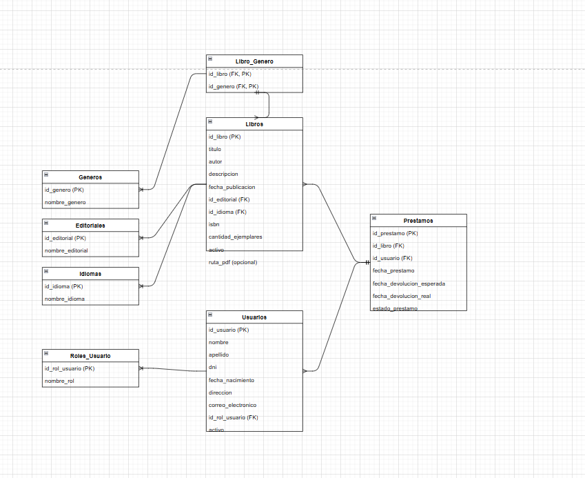
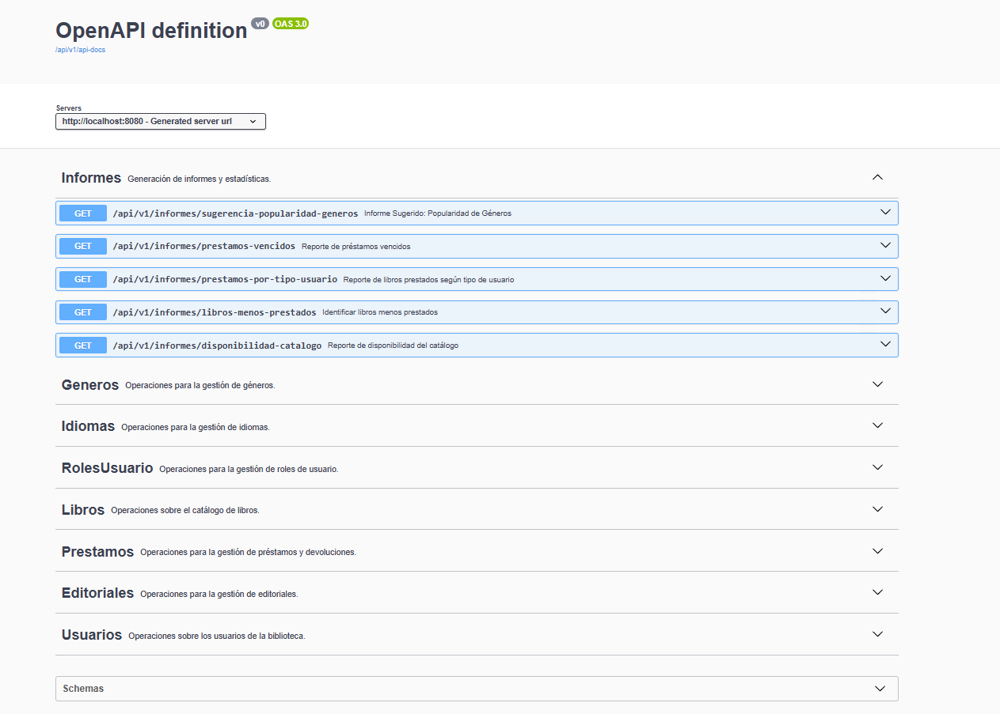

# Biblioteca El Búho Lector - Búhoristeca API

Sistema para informatizar el proceso de préstamo de libros, abarcando la gestión del catálogo, el registro de usuarios y el seguimiento de los préstamos y devoluciones.

## Descripción General

Este proyecto implementa la API para el sistema de la biblioteca "El Búho Lector". Utiliza Spring Boot con Java 21 y MySQL.

Una característica clave de este proyecto es el uso del **`openapi-generator-maven-plugin`**. Este plugin genera automáticamente:
* **DTOs (Data Transfer Objects)**: Clases Java que modelan los datos intercambiados con la API (requests y responses). Estos se generan en el paquete `com.buhoristeca.lector.dtos`.
* **Interfaces de Controladores (API Resources)**: Interfaces Java que definen los endpoints de la API. Estas se generan en el paquete `com.buhoristeca.lector.controllers.resources`.

Los desarrolladores luego implementan estas interfaces generadas en sus clases de controlador (`@RestController`). Esto asegura que la implementación de la API se mantenga sincronizada con la especificación definida en el archivo `openapi.yml`.

## Prerrequisitos

* **Java 21 (JDK)**: Asegúrate de tener JDK 21 o superior instalado.
* **Maven**: Para la gestión de dependencias y la construcción del proyecto.
* **MySQL**: Una instancia de MySQL Server en ejecución.
* **IDE (Opcional pero Recomendado)**: IntelliJ IDEA, Eclipse, VS Code con soporte para Java y Maven.


# Proyecto Set UP

Generacion de  DTOs from openapi.yml and Mappers:
```shell
mvn clean

mvn compile

docker-compose.yml docker-compose up

mvn install
```
Application start up:
```shell
mvn spring-boot:run
```
Test run
```shell
mvn clean test
```

## DER


## Configuración de la Base de Datos

1.  Asegúrate de que tu servidor MySQL esté en funcionamiento.
2.  Crea una base de datos para la aplicación (por ejemplo, `buholector_db`).
3.  Actualiza el archivo `src/main/resources/application.properties` con la configuración de tu base de datos:

    ```properties
    spring.datasource.url=jdbc:mysql://localhost:3306/buholector_db?useSSL=false&serverTimezone=UTC
    spring.datasource.username=tu_usuario_mysql
    spring.datasource.password=tu_contraseña_mysql
    spring.datasource.driver-class-name=com.mysql.cj.jdbc.Driver

    spring.jpa.hibernate.ddl-auto=update # O 'validate' en producción después de la creación inicial
    spring.jpa.show-sql=true
    spring.jpa.properties.hibernate.dialect=org.hibernate.dialect.MySQLDialect

    ```
## Ver la documentación swagger
url : http://localhost:8080/swagger-ui/index.html



## Generación de Código con OpenAPI Generator

El diseño de API primero fomenta la coherencia dentro de la API, ya que todo el diseño se realiza de una vez.

El proyecto utiliza `openapi-generator-maven-plugin` para generar DTOs e interfaces de API a partir del archivo `openapi.yml` ubicado en la raíz del proyecto.

Proceso de Generación: Cuando construyes el proyecto con Maven (por ejemplo, con mvn clean install o mvn compile), este plugin se ejecutará y generará el código en el directorio src/gen/java/main. Asegúrate de que este directorio esté marcado como una carpeta de fuentes (source folder) en tu IDE si no lo hace automáticamente.

La configuración del plugin en el `pom.xml` es la siguiente:

```xml
<plugin>
    <groupId>org.openapitools</groupId>
    <artifactId>openapi-generator-maven-plugin</artifactId>
    <version>7.5.0</version>
    <executions>
       <execution>
          <goals>
             <goal>generate</goal>
          </goals>
          <configuration>
             <inputSpec>${project.basedir}/openapi.yml</inputSpec>
             <generatorName>spring</generatorName>
             <generateSupportingFiles>false</generateSupportingFiles>
             <skipOperationExample>true</skipOperationExample>
             <generateApis>true</generateApis> <generateModelTests>false</generateModelTests>
             <generateApiTests>false</generateApiTests>
             <modelPackage>com.buhoristeca.lector.dtos</modelPackage> <apiPackage>com.buhoristeca.lector.controllers.resources</apiPackage> <modelNameSuffix>DTO</modelNameSuffix> <apiNameSuffix>Resource</apiNameSuffix> <configOptions>
                <useResponseEntity>false</useResponseEntity>
                <useTags>true</useTags>
                <interfaceOnly>true</interfaceOnly> <sourceFolder>src/gen/java/main</sourceFolder> <useSpringBoot3>true</useSpringBoot3>
                <containerDefaultToNull>true</containerDefaultToNull>
                <additionalModelTypeAnnotations>
                   @com.fasterxml.jackson.annotation.JsonIgnoreProperties(ignoreUnknown = true)
                </additionalModelTypeAnnotations>
             </configOptions>
          </configuration>
       </execution>
    </executions>
</plugin>


     